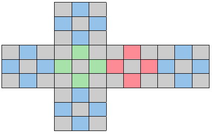

### CI5437 - Inteligencia Artificial 1
##### Prof. Carlos Infante

# Proyecto 1

Por <a href='https://www.github.com/chrischriscris'>Chus</a> | <a href='https://www.github.com/fungikami'>K</a>

 
## 1. Introducción

En materia de Inteligencia Artificial, los algoritmos de búsqueda informada son de relevancia para encontrar soluciones a distintos problemas. A* e IDA* son algoritmos de búsqueda informada que utilizan una función heurística para guiar la búsqueda hacia la solución óptima. Mientras mejor sea la heurística, más eficiente será el algoritmo. En particular, la heurística llamada PDB (Pattern Database) permite resolver el problema al proyectarlo en un espacio de estados de menor dimensión, para así solucionar cada subproblema de manera independiente. Si al sumar las soluciones de cada subproblema se cumplen con las características de admisibilidad y consistencia, entonces la heurística PDB es aditiva. En cambio, si no se cumple lo anterior, es no-aditiva y se puede tomar el máximo de las soluciones.

Por ello, en el siguiente trabajo se estudiará el modelo de espacio de estados y los diferentes algoritmos de búsqueda heurística (A* e IDA*) en distintos problemas como N-puzzle, Top-Spin, Torres de Hanoi y Cubo de Rubik.

## 2. Árboles de búsqueda

### 2.1. Implementación de algoritmos de búsqueda

Para estudiar el factor de ramificación de los árboles de búsqueda de cada problema, se implementaron los algoritmos de Búsqueda en Amplitud (*BFS*) y Búsqueda en Profundidad Iterativa (*IDDFS*). Para cada problema, se ejecutaron los algoritmos con y sin eliminación de duplicados, y se registró el número de estados generados a cada profundidad.

### 2.2. Resultados experimentales

#### 2.2.1. Búsqueda en Amplitud (BFS)
En la siguiente tabla (Tabla 1) se muestran los resultados obtenidos al ejecutar el algoritmo de búsqueda BFS para cada problema durante varios segundos (hasta que la memoria RAM se agotara). En particular, se muestra el número de estados generados en el último nivel alcanzado, así como la ramificación promedio de los árboles de búsqueda.

Para mayor detalles sobre el número de estados generados en cada profundidad y su factor de ramificación, los resultados se encuentran en el archivo `SearchTree/BFS_IDDFS.ods`.

| Puzzle |  Nro. de estados (SP) | Ramificación (SP) | Tiempo (SP) | Nro. de estados (CP) | Ramificación (CP) | Tiempo (CP) |
|:------:|:----------------------------:|:----------------------:| :-------------------:|:----------------------:| :-------------------:|:----------------------:|
|  15-puzzle  | 109602413 | 3.236 | 5s | 163211917 | 2.130 | 6s |
|  24-puzzle  | 67324011 | 3.444 | 4s | 109399155 | 2.340 | 5.5s |
| Top Spin 12-4 | 39089245 | 12 | 5s | 221869069 | 7.872 | 6s |
| Top Spin 14-4 | 113522235 | 14 | 6s | 55567064 | 8.425 | 5.5s |
| Top Spin 17-4 | 25646167 | 17 | 5.5s | 131954182 | 9.171 | 5s |
| Hanoi Tower 4-12 | 76856812 | 5.663 | 5s | 33063208 | 5.14 | 4.5s |
| Hanoi Tower 4-14 | 13569751 | 5.633 | 3.2s | 33063208 | 5.14 | 5s |
| Hanoi Tower 4-18 | 13569751 | 5.633 | 3.5s | 33063208 | 5.14 | 3s |
| Rubik 3x3x3 | 36012943 | 18 | 4s | 8331112 | 13.348 | 3.5s |

Tabla 1 BFS sin y con eliminación de duplicados

En las siguientes figuras se muestra los gráficos obtenidos

|  |  |
|:-----------------------------:|:-----------------------------:|
| Figura 2.1 | Figura 2.2 |

#### 2.2.2. Búsqueda en Profundidad Iterativa (IDDFS)
En la siguiente tabla (Tabla 2) se muestran los resultados obtenidos al ejecutar el algoritmo de búsqueda IDDFS para cada problema durante 15 minutos. En particular, se muestra el número de estados generados en el último nivel alcanzado, así como la ramificación promedio de los árboles de búsqueda.

Para mayor detalles sobre el número de estados generados en cada profundidad y su factor de ramificación, los resultados se encuentran en el archivo `SearchTree/BFS_IDDFS.ods`.

| Puzzle |  Nro. de estados (SP) | Ramificación (SP) | Nro. de estados (CP) | Ramificación (CP) |
|:------:|:----------------------------:|:----------------------:| :-------------------:|:----------------------:|
|  15-puzzle  | 38896297583 | 3.236 | 32507303773 | 2.130 |
|  24-puzzle  |  33773166807  | 3.483 | 19269183847 | 2.341 |
| Top Spin 12-4 | 67546215517 | 12 | 13752303583 | 7.873 |
| Top Spin 14-4 | 22250358075 | 14 | 33239982329 | 8.425 |
| Top Spin 17-4 | 7411742281 | 17 | 11100301327 | 9.171 |
| Hanoi Tower 4-12 | 14306094361 | 5.729 | 4604326123 | 5.201 |
| Hanoi Tower 4-14 | 14306094361 | 5.729 | 24021362452 | 5.217 |
| Hanoi Tower 4-18 | 14306094361 | 5.729 | 4604326123 | 5.201 |
| Rubik 3x3x3 | 11668193551 | 18 | 19815150304 | 13.348 |

Tabla 2 IDDFS sin y con eliminación de duplicados

En las siguientes figuras se muestra el número de estados generados en cada profundidad de los árboles de búsqueda, para cada problema.

|  |  |
|:-----------------------------:|:-----------------------------:|
| Figura 2.1 | Figura 2.2 |

### 2.3. Análisis de resultados

Al observar las tablas y las gráficas anteriores, se puede observar como la eliminación de duplicados reduce significativamente el número de estados generados en cada profundidad. Por ejemplo, para el caso de 15-puzzle sin pruning, el número de estados generados con profundidad 15 es de 107, mientras que con pruning es de 105. 

En particular, para el Top-Spin y el Cubo de Rubik 3x3x3, el factor de ramificación sin eliminación de duplicados, se mantiene igual en cada profundidad. Esto se debe a que en estos puzzles no tienen estados inválidos que reduzcan el número de posibles movimientos, como podría ocurrir en el 15-puzzle o en las Torres de Hanoi. Por otro lado, se puede observar que el número de estados generados con eliminación de duplicados hasta una profundidad cercana de 10 en los distintos casos de la Torre de Hanoi es igual. Esto se debe a que, dado que se parte del estado final, no es posible mover los discos más grandes, por lo que los primeros movimientos son los mismos en cada caso hasta cierta profundidad.

Ahora, al comparar la cantidad de estados generados por profundidad entre puzzles, se puede observar que para el Top-Spin y el Cubo de Rubik 3x3x3 se tiene un crecimiento acelerado en el número de estados generados (más de 1010 estados en una profundidad de 9), mientras que para las Torres de Hanoi y el 15-puzzle el crecimiento es más lento (104 estados en profundidad 10). Esto se debe a que en los primeros puzzles se tienen más movimientos posibles que en los últimos, por lo que el factor de ramificación es mayor y puede ser un indicador en el rendimiento de los algoritmos de búsqueda. 

Al comparar entre los distintos algoritmos de búsqueda, la primera diferencia es que con IDDFS se logra llegar a profundidades mayores que con BFS. Esto se debe a que, el consumo de memoria de BFS es mucho mayor que el de IDDFS, por lo que se puede llegar a un límite de memoria antes de llegar a un tiempo de ejecución establecido. Sin embargo, el tiempo de ejecución que puede tomarle a IDDFS llegar a cierta profundidad es mucho mayor que el de BFS. Por ejemplo, para el caso de Cubo de Rubik 3x3x3, el BFS (sin pruning) tomó 4 segundos en llegar a profundidad 6, mientras que para el IDDFS le tomó más 8 minutos.

## 3. Heurísticas

### 3.1. Implementación de heurísticas

#### N-Puzzles (15-puzzle, 24-puzzle)

##### Distancia Manhattan:
Se implementó la distancia Manhattan para el caso de 15-puzzle.

##### PDBs Aditivos:
Las abstracciones utilizadas para generar los PDBs corresponden a subdivisiones del problema, al eliminar piezas del puzzle para ser resueltas por separado. En particular, se utilizó la siguiente abstracción:

|  |  |
|:-----------------------------:|:-----------------------------:|
| Figura 3.1 15-puzzle | Figura 3.2 24-puzzle |

#### Top Spin (12-4, 14-4, 17-4)

##### Máximo de PDBs:

|  |  |  |
|:-----------------------------:|:-----------------------------:| :-----------------------------:|
| Figura 4.1 | Figura 4.2 | Figura 4.3 |

#### Torre de Hanoi (4-12, 4-14, 4-18)

##### Máximo de PDBs:

|  |  |  |
|:-----------------------------:|:-----------------------------:| :-----------------------------:|
| Figura 5.1 Hanoi 4-12 | Figura 5.2 Hanoi 4-14 | Figura 5.3 Hanoi 4-18 |

#### Cubo de Rubik 3x3x3

##### Máximo de PDBs:

|  |  |  |
|:-----------------------------:|:-----------------------------:| :-----------------------------:|
| Figura 6.1 Rubik Esquinas | Figura 6.2 Rubik Lados | Figura 6.3 Rubik Lados |

## 4. Algoritmos de búsqueda informada

### 4.1. Implementación de algoritmos de búsqueda informada

Para el estudio de los algoritmos de búsqueda informada, se implementaron los algoritmos de A* y IDA*.

### 4.2. Resultados experimentales

### 4.2.0. Entorno de pruebas

Para la ejecución de los algoritmos de búsqueda informada, se utilizaron computadores con las siguientes características:

| Procesador | RAM | Sistema Operativo |
|:----------:|:---:|:-----------------:|
| Intel i3-2120 (4) @ 3.300GHz | 3797MiB | Debian GNU/Linux 11 (bullseye) x86_64 |
| Intel i5-1035G1 (8) @ 3.600GHz | 7689MiB | Pop!_OS 22.04 LTS x86_64 |

Por otro lado, los algoritmos de búsqueda fueron implementados en C++, compilado con `g++ (Ubuntu 11.3.0-1ubuntu1~22.04) 11.3.0` usando las flags `-Wall -Ofast -Wno-unused-function -Wno-unused-variable -march=native`.

Para la generación del espacio de estados, las PDBs y las abstracciones se usó el lenguaje declarativo de propósito específico PSVN (01 de Junio de 2014) y el compilador `psvn2c`.

Finalmente, para la generación de los árboles de búsqueda de la parte 2 se registró un signal handler para el signal `SIGTERM` y el comando `timeout 900` de coreutils para limitar el tiempo de ejecución de los algoritmos y mostrar la cantidad de nodos expandidos hasta el momento de la interrupción. Además, se utilizó el comando `taskset -c <num>` para asignar los procesos a un único core de la CPU y mantener la consistencia en los tiempos de ejecución a la vez que se evita la migración de procesos entre cores por parte del scheduler del sistema operativo.

#### 4.2.1. N-puzzle

##### 15-puzzle

Para el caso de 15-puzzle se escogieron distintos casos del benchmark suministrado por en el repositorio del proyecto. Los resultados obtenidos al ejecutar A* y IDA* con las distintas heurísticas implementadas se muestran en la siguiente tabla:

###### Distancia Manhattan

| Dificultad | Caso | Distancia | Nodos Expandidos (A*) | Tiempo (s) (A*) | Nodos Expandidos (IDA*) |Tiempo (s) (IDA*) |
|:---------: |:----:|:---------:|:----------------:|:----------:|:----------------:|:----------:|
|     F      | 001  |  53       | 3417680          | 0.420356   | -                 | -          |
|     F      | 098  |  54       | 59287638         | 7.240532   | -                 | -          |
|     M      | 066  |  61       | -                | -          | -                 | -          |
|     M      | 092  |  57       | -                | -          | -                 | -          |
|     D      | 060  |  66       | -                | -          | -                 | -          |
|     D      | 088  |  0        | -                | -          | -                 | -          |

###### PDBs Aditivos 

| Dificultad | Caso | Distancia |  Nodos Expandidos (A*) | Tiempo (s) (A*) | Nodos Expandidos (IDA*) | Tiempo (s) (IDA*) |
|:---------: |:----:|:---------:|:----------------:|:----------:|:----------------:|:----------:|
|     F      | 001  |  53       |  758692          |  0.238309  |  1897987          |  0.532977758692           |
|     F      | 098  |  54       |  10979210        |  3.515864  |  15470192         |  4.78792110979210         |
|     M      | 066  |  61       |  183969804       |  67.610847 |  263565280        |  81.119598183969804       |
|     M      | 092  |  57       |  122188242       |  42.458721 |   177216682       |  56.329090122188242       |
|     D      | 060  |  66       |  209369274       |  73.483856 |  279640009        |  84.853249209369274       |
|     D      | 088  |  0        |  -               |  -         |  294857932        |  93.753624-               |

##### 24-puzzle

En el caso de 24-puzzle, dado que no se pudo ejecutar los casos de prueba del benchmark proporcionado, se generó casos de pruebas con distintas profundidades. Los resultados obtenidos al ejecutar A* y IDA* con PDBs aditivas se muestran en la siguiente tabla:

| Profundidad | Distancia |  Nodos Expandidos (A*) | Tiempo (s) (A*) | Nodos Expandidos (IDA*) | Tiempo (s) (IDA*) |
|:----------: |:---------:|:----------------:|:----------:|:----------------:|:----------:|
|   100       | 44          | 246674            | 0.126127  | 216515         |   0.127956   |
|   100       | 42          | 29842             | 0.013072  | 36790          |   0.019922   |
|   100       | 32          | 920               | 0.000449  | 746            |   0.000532   |
|   100       | 32          | 3822              | 0.001733  | 3065           |   0.002027   |
|   100       | 26          | 178               | 0.000106  | 100            |   0.000071   |
|   100       | 34          | 810               | 0.000414  | 81             |   0.000054   |
|   100       | 26          | 1132              | 0.000532  | 406            |   0.000266   |
|   100       | 36          | 152               | 0.000105  | 40             |   0.000026   |
|   100       | 38          | 3484              | 0.001688  | 6354           |   0.003590   |
|   100       | 48          | 1087498           | 0.577211  | 1587177        |   0.972064   |
|   150       | 60          | 37473366          | 22.741772 | 39199222       |   26.277927  |
|   150       | 52          | 550888            | 0.282170  | 286317         |   0.193856   |
|   150       | 38          | 29554             | 0.013817  | 21789          |   0.014983   |
|   150       | 28          | 2680              | 0.001319  | 598            |   0.000445   |
|   150       | 44          | 365360            | 0.168241  | 431845         |   0.291052   |
|   150       | 56          | 140918            | 0.074927  | 186485         |   0.114000   |
|   150       | 60          | 52241498          | 32.408016 | 65236811       |   45.932323  |
|   150       | 54          | 540702            | 0.291398  | 944672         |   0.651577   |
|   150       | 48          | 1285594           | 0.703550  | 1758325        |   1.279373   |
|   150       | 40          | 14032             | 0.006908  | 8711           |   0.006590   |
 
#### 4.2.2. Top Spin 

En las siguientes tablas se muestran los resultados obtenidos al ejecutar A* y IDA* con el máximo de PDBs para el problema Top Spin.
##### 12-4

| Profundidad | Distancia |  Nodos Expandidos (A*) | Tiempo (s) (A*) | Nodos Expandidos (IDA*) | Tiempo (s) (IDA*) |
|:----------: |:---------:|:----------------:|:----------:|:----------------:|:----------:|
| 2000000     | 9         | 124             | 0.000292      | 32      | 0.000122  |
| 2000000     | 10        | 220             | 0.000419      | 56      | 0.000183  |
| 2000000     | 9         | 40              | 0.000089      | 16      | 0.000049  |
| 2000000     | 11        | 914             | 0.001601      | 410     | 0.001285  |
| 2000000     | 9         | 318             | 0.000511      | 23      | 0.000066  |
| 2000000     | 9         | 54              | 0.000121      | 13      | 0.000033  |
| 2000000     | 7         | 16              | 0.000034      | 7       | 0.000011  |
| 2000000     | 8         | 18              | 0.000040      | 9       | 0.000021  |
| 2000000     | 9         | 74              | 0.000160      | 42      | 0.000115  |
| 2000000     | 10        | 146             | 0.000284      | 76      | 0.000213  |

##### 14-4

| Profundidad | Distancia |  Nodos Expandidos (A*) | Tiempo (s) (A*) | Nodos Expandidos (IDA*) | Tiempo (s) (IDA*) |
|:----------: |:---------:|:----------------:|:----------:|:----------------:|:----------:|
| 2000000     | 10        |   956            |    0.001716    | 344        |    0.001313 |
| 2000000     | 12        |   160354         |    0.261832    | 21151      |    0.080119 |
| 2000000     | 12        |   74926          |    0.113400    | 34034      |    0.109881 |
| 2000000     | 12        |   16900          |    0.030627    | 9844       |    0.027710 |
| 2000000     | 11        |   7704           |    0.010159    | 2378       |    0.006021 |
| 2000000     | 11        |   3516           |    0.006684    | 2349       |    0.006139 |
| 2000000     | 10        |   74             |    0.000191    | 187        |    0.000917 |
| 2000000     | 11        |   8390           |    0.015362    | 2716       |    0.006619 |
| 2000000     | 9         |   138            |    0.000358    | 73         |    0.000188 |
| 2000000     | 11        |   9722           |    0.015069    | 2336       |    0.005629 |

##### 17-4

| Profundidad | Distancia |  Nodos Expandidos (A*) | Tiempo (s) (A*) | Nodos Expandidos (IDA*) | Tiempo (s) (IDA*) |
|:----------: |:---------:|:----------------:|:----------:|:----------------:|:----------:|
| 10          | 10        | 7912             | 0.012040   | 3110             | 0.008535   |
| 10          | 8         | 282              | 0.000722   | 29               | 0.000094   |
| 10          | 9         | 1370             | 0.002308   | 308              | 0.001292   |
| 10          | 10        | 6180             | 0.007259   | 2366             | 0.007776   |
| 10          | 10        | 3858             | 0.007401   | 245              | 0.000797   |
| 10          | 8         | 18               | 0.000072   | 22               | 0.000117   |
| 10          | 10        | 1488             | 0.002919   | 2215             | 0.007443   |
| 10          | 10        | 32654            | 0.048375   | 5675             | 0.015156   |
| 10          | 10        | 388              | 0.000973   | 1454             | 0.006220   |
| 10          | 10        | 24128            | 0.038113   | 11030            | 0.030779   |
| 2000000     | 15        | -                | -          | 7448189          | 19.421900  |
| 2000000     | 15        | -                | -          | 23228714         | 60.486927  |
| 2000000     | 15        | -                | -          | 15515494         | 39.592648  |
| 2000000     | 15        | -                | -          | 8261731          | 21.820154  |
| 2000000     | 15        | -                | -          | 31269587         | 82.322601  |
| 2000000     | 15        | -                | -          | 9952405          | 26.009096  |
| 2000000     | 15        | -                | -          | 15773297         | 46.423286  |
| 2000000     | 15        | -                | -          | 10607127         | 29.888981  |
| 2000000     | 15        | -                | -          | 9567393          | 28.303879  |
| 2000000     | 15        | -                | -          | 11708099         | 30.111568  |

Para los casos de distancia 15, el algoritmo A* no termina de ejecutarse dado que se agota la memoria del computador. 

#### 4.2.3. Torre de Hanoi

Para los casos de la Torre de Hanoi, se generaron casos de prueba de profundidad 250 y 2000. En la siguiente tabla se muestran los resultados obtenidos para cada uno de los casos.

##### 12-4

| Profundidad | Distancia |  Nodos Expandidos (A*) | Tiempo (s) (A*) | Nodos Expandidos (IDA*) | Tiempo (s) (IDA*) |
|:----------: |:---------:|:----------------:|:----------:|:----------------:|:----------:|
| 250         | 13        | 28               | 0.000132   | 13               | 0.000045   |
| 250         | 16        | 1344             | 0.000865   | 1038             | 0.001175   |
| 250         | 15        | 2184             | 0.001015   | 4311             | 0.004334   |
| 250         | 17        | 19242            | 0.006702   | 257225           | 0.227280   |
| 250         | 15        | 2018             | 0.000994   | 3402             | 0.004004   |
| 250         | 8         | 18               | 0.000020   | 8                | 0.000008   |
| 250         | 14        | 30               | 0.000035   | 14               | 0.000014   |
| 250         | 16        | 11010            | 0.003749   | 6491             | 0.005956   |
| 250         | 18        | 25178            | 0.006613   | 65279            | 0.057485   |
| 250         | 12        | 26               | 0.000065   | 12               | 0.000031   |
| 2000        | 22        | 244676           | 0.085018   | - | - |
| 2000        | 38        | 152467624        | 33.135445  | - | - |
| 2000        | 31        | 18936488         | 4.261317   | - | - |
| 2000        | 29        | 5824594          | 1.366256   | - | - |
| 2000        | 29        | 5968026          | 1.409831   | - | - |
| 2000        | 40        | 349523784        | 80.153206  | - | - |
| 2000        | 19        | 54852            | 0.015606   | - | - |
| 2000        | 37        | 174733374        | 40.291119  | - | - |
| 2000        | 25        | 1295760          | 0.307966   | - | - |
| 2000        | 15        | 2050             | 0.000701   | - | - | 

Para los casos generados con profundidad 2000, el algoritmo IDA* no termina de ejecutarse tras más de 15 minutos de ejecución.

##### 14-4

| Profundidad | Distancia |  Nodos Expandidos (A*) | Tiempo (s) (A*) | Nodos Expandidos (IDA*) | Tiempo (s) (IDA*) |
|:----------: |:---------:|:----------------:|:----------:|:----------------:|:----------:|
| 300         | 14        | 30               | 0.000136   | 14             | 0.000056     |
| 300         | 21        | 13814            | 0.008797   | 337086         | 0.373795     |
| 300         | 15        | 32               | 0.000040   | 15             | 0.000014     |
| 300         | 24        | 101538           | 0.035322   | 25439664       | 26.143175    |
| 300         | 16        | 34               | 0.000075   | 16             | 0.000018     |
| 300         | 9         | 20               | 0.000026   | 9              | 0.000009     |
| 300         | 10        | 22               | 0.000041   | 10             | 0.000010     |
| 300         | 18        | 38               | 0.000060   | 18             | 0.000019     |
| 300         | 16        | 34               | 0.000062   | 16             | 0.000138     |
| 300         | 4         | 10               | 0.000032   | 4              | 0.000004     |
| 2000        | 21        |44                | 0.000116   | - | - |
| 2000        | 25        |210252            | 0.072090   | - | - |
| 2000        | 23        |136316            | 0.039221   | - | - |
| 2000        | 27        |650518            | 0.181916   | - | - |
| 2000        | 31        |4536780           | 1.226189   | - | - |
| 2000        | 25        |475776            | 0.140807   | - | - |
| 2000        | 35        |10215432          | 2.481254   | - | - |
| 2000        | 23        |179486            | 0.048595   | - | - |
| 2000        | 17        |36                | 0.000036   | - | - |
| 2000        | 27        |766014            | 0.212964   | - | - |

Para los casos generados con profundidad 2000, el algoritmo IDA* no termina de ejecutarse tras más de 15 minutos de ejecución.

##### 18-4 

| Profundidad | Distancia |  Nodos Expandidos (A*) | Tiempo (s) (A*) | Nodos Expandidos (IDA*) | Tiempo (s) (IDA*) |
|:----------: |:---------:|:----------------:|:----------:|:----------------:|:----------:|
|  2000       | 21        | 44               | 0.000131   | 21      | 0.000093 |
|  2000       | 20        | 42               | 0.000117   | 20      | 0.000039 | 
|  2000       | 18        | 38               | 0.000115   | 18      | 0.000031 | 
|  2000       | 34        | 70               | 0.000172   | 34      | 0.000055 | 
|  2000       | 28        | 58               | 0.000126   | 28      | 0.000045 | 
|  2000       | 27        | 56               | 0.000135   | 27      | 0.000046 | 
|  2000       | 33        | 68               | 0.000148   | 33      | 0.000053 | 
|  2000       | 36        | 277764           | 0.112331   | -       | -        |
|  2000       | 21        | 44               | 0.000079   | 21      | 0.000034 |
|  2000       | 29        | 60               | 0.000105   | 29      | 0.000046 |

#### 4.2.4. Cubo de Rubik 3x3x3

Para el caso del Cubo de Rubik 3x3x3 se generaron varios casos de pruebas de profundidad 10 y 15. Los resultados obtenidos se muestran en la siguiente tabla:

| Profundidad | Distancia |  Nodos Expandidos (A*) | Tiempo (s) (A*) | Nodos Expandidos (IDA*) | Tiempo (s) (IDA*) |
|:----------: |:---------:|:----------------:|:----------:|:----------------:|:----------:|
| 10          | 8         | 60               | 0.000337   | 11               | 0.000152   |
| 10          | 8         | 580              | 0.001876   | 229              | 0.002478   |
| 10          | 8         | 80               | 0.000520   | 39               | 0.000410   |
| 10          | 10        | 8962             | 0.049020   | 1880             | 0.021890   |
| 10          | 4         | 10               | 0.000097   | 4                | 0.000021   |
| 10          | 9         | 102              | 0.000620   | 41               | 0.000448   |
| 10          | 7         | 1374             | 0.003806   | 171              | 0.001987   |
| 10          | 7         | 24               | 0.000139   | 7                | 0.000050   |
| 10          | 7         | 24               | 0.000153   | 16               | 0.000142   |
| 10          | 8         | 50               | 0.000362   | 24               | 0.000242   |
| 15          | 13        | -                | -          | 8421346          | 76.624748  | 
| 15          | 10        | -                | -          | 3489             | 0.042593   |
| 15          | 12        | -                | -          | 55730            | 0.630784   |
| 15          | 13        | -                | -          | 1675391          | 18.259687  |
| 15          | 13        | -                | -          | 1418391          | 15.173393  |
| 15          | 12        | -                | -          | 276867           | 2.775264   |
| 15          | 12        | -                | -          | 382545           | 4.149523   |
| 15          | 11        | -                | -          | 149057           | 1.438193   |
| 15          | 11        | -                | -          | 17431            | 0.192606   |
| 15          | 14        | -                | -          | 18994540         | 177.679749 |

Para los casos generados con profundidad 15, el algoritmo A* no termina de ejecutarse dado que se agota la memoria del computador.

### 4.3. Análisis de resultados

Luego de obtener los resultados de los experimentos, se pueden realizar las siguientes observaciones:

- Para el 15 puzzle, se puede observar que para el caso con la heurística de distancia Manhattan implementada, el único algoritmo que logró ser ejecutado fue A* con los casos de dificultad fácil. Por otro lado, con PDBs Aditivos, el algoritmo A* obtuvo mejores tiempos en ejecución.

- Para el 24 puzzle, en general, ambos algoritmos presentaron tiempos de ejecución similares para los distintos casos. No obstante, a medida que la distancia aumenta, IDA* presenta un número de nodos expandidos mayor y con ello, un tiempo de ejecución mayor.

- Para los distintos casos del Top-Spin, en general, IDA* presentó un tiempo de ejecución mejor que con A*. A su vez, para el caso de Top-Spin 17-4, A* no logra de terminar su ejecución en casos con distancia igual a 15, dado que se agota la memoria del computador.

- Para los distintos casos de la Torre de Hanoi, el algoritmo A* presentó un tiempo de ejecución mejor que con IDA*. A su vez, en los Top-Spin 12-4 y 14-4 con los casos generados de profundidad = 2000, IDA* no logra ejecutarse en un tiempo límite de 15 minutos (casos donde en A* se expande un número mayor de 120000 nodos aproximadamente). No obstante, para el Top-Spin 18-4, IDA* logra ejecutarse en un tiempo menor que A*, siendo casos donde no se expanden más de 40 nodos en IDA*. 

- Para el Cubo de Rubik 3x3x3, los tiempos de ejecución de ambos algoritmos fueron similares cuando la distancia a la solución fuera menor que 10. No obstante, a mayor distancia, A* no logra terminar la ejecución dado que se agota la memoria del computador.

- Como generalidad, se logra observar el intercambio que existe entre complejidad temporal y espacial de los algoritmos: mientras que no necesariamente uno de los algoritmos siempre expande menos nodos que el otro, para casos de mayor dificultad el algoritmo A* da con una solución de forma más rápida, en cuanto se tenga memoria suficiente para ejecutarlo. Por otro lado, el IDA* aliviana este requerimiento a una cantidad de espacio lineal, por lo que, a pesar de ser útil en casos en los que el A* no logra terminar por falta de recursos computacionales, hace esto a costas de un tiempo de ejecución mucho más elevado.

- Dependiendo de la forma del problema, existen problemas que - por lo menos empíricamente- no pueden hacerse más difíciles. Esto se llega a notar en casos como el Top Spin 12-4, en el que los casos de prueba generados con profundidad de 2 millones no llega a ser considerablemente más difícil que a profundidad 20.

- Un factor que en situaciones puede aventajar al IDA* es el hecho fortuito de encontrarse con el camino óptimo expandiendo menos nodos que el A*, lo cual suele ser más común en casos de poca dificultad, en los que el A* debe terminar de revisar todos los nodos con un f-valor dado antes de avanzar al siguiente.

- La forma en que se representa el problema, y la forma en que se guardan y codifican las PDB tiene un impacto fundamental en la eficiencia y eficacia de los algoritmos, y esto se nota más en casos críticos. En varios de los casos el tamaño de las PDBs se hacía muy elevado, hasta el punto que solo cargarla requería ~2500 megabytes de RAM, haciendo el problema incosteable en computadores con recursos más limitados. En este sentido, la facilidad que da para el desarrollo un lenguaje de propósito específico como PSVN hace perder cierta flexibilidad en la representación del problema y la forma en que este se guarda en una PDB, lo cual puede ser deseable en caso de quere aprovechar al máximo los recursos disponibles.

## 5. Conclusiones

En general, el rendimiento de algoritmos como A* e IDA* dependen del tipo de problema al que se quiera resolver, y con ello, la dificultad de los casos de prueba. Se observó que mientras la longitud de las soluciones de un puzzle sea mayor, peor será su rendimiento con IDA*, dado que tendrá que recorrer todo el espacio de búsqueda en cada profundidad (como se pudo observar con las Torres de Hanoi). En cambio, si las soluciones tienen un longitud pequeña, IDA* tendrá un mejor rendimiento  (como se pudo observar con el Top-Spin).

Asimismo, la elección de las heurísticas pueden influir en el rendimiento de los algoritmos. Por ejemplo, para el 15 puzzle, al tomar como heurística la distancia Manhattan, no se logró ejecutar la mayoría de los casos seleccionados. En cambio, al tomar como heurística PDBs Aditivos, se logró ejecutar todos los casos seleccionados.

En conclusión, se puede decir que el algoritmo A* es, tal como dice la teoría (asintóticamente óptimo), eficiente y el más favorable a elegir cuando se dispone de los recursos, mientras que IDA* es más favorable cuando se dispone de más tiempo o en instancias del problema sencillos.

