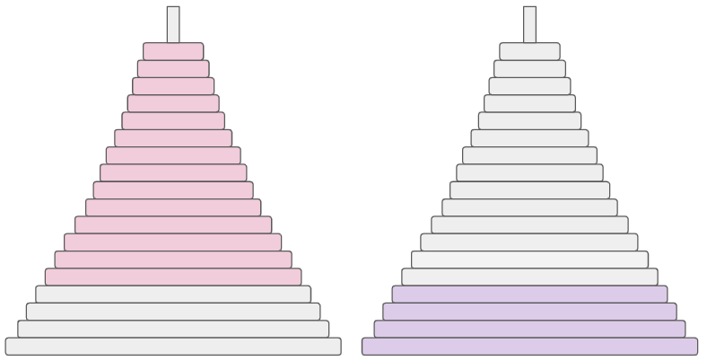

### CI5437 - Inteligencia Artificial 1
##### Prof. Carlos Infante

# Proyecto 1

Por <a href='https://www.github.com/chrischriscris'>Chus</a> | <a href='https://www.github.com/fungikami'>K</a>

 
## 1. Introducción

En materia de Inteligencia Artificial, los algoritmos de búsqueda informada son de relevancia para encontrar soluciones a distintos problemas. A* e IDA* son algoritmos de búsqueda informada que utilizan una función heurística para guiar la búsqueda hacia la solución óptima. Mientras mejor sea la heurística, más eficiente será el algoritmo. En particular, la heurística llamada PDB (Pattern Database) permite resolver el problema al proyectarlo en un espacio de estados de menor dimensión, para así solucionar cada subproblema de manera independiente. Si al sumar las soluciones de cada subproblema se cumplen con las características de admisibilidad y consistencia, entonces la heurística PDB es aditiva. En cambio, si no se cumple lo anterior, es no-aditiva y se puede tomar el máximo de las soluciones.

Por ello, en el siguiente trabajo se estudiará el modelo de espacio de estados y los diferentes algoritmos de búsqueda heurística (A* e IDA*) en distintos problemas como N-puzzle, Top-Spin, Torres de Hanoi y Cubo de Rubik.

## 2. Árboles de búsqueda

### 2.1. Implementación de algoritmos de búsqueda

Para estudiar el factor de ramificación de los árboles de búsqueda de cada problema, se implementaron los algoritmos de Búsqueda en Amplitud (*BFS*) y Búsqueda en Profundidad Iterativa (*IDDFS*). Para cada problema, se ejecutaron los algoritmos con y sin eliminación de duplicados, y se registró el número de estados generados a cada profundidad. 
### 2.2. Resultados experimentales

#### 2.2.1. Búsqueda en Amplitud (BFS)
En la siguiente tabla (Tabla 1) se muestran los resultados obtenidos al ejecutar el algoritmo de búsqueda BFS para cada problema durante varios segundos (hasta que la memoria RAM se agotara). En particular, se muestra el número de estados generados en el último nivel alcanzado, así como la ramificación promedio de los árboles de búsqueda.

Para mayor detalles sobre el número de estados generados en cada profundidad y su factor de ramificación, los resultados se encuentran en el archivo `SearchTree/BFS_IDDFS.ods`.

| Puzzle |  Nro. de estados (SP) | Ramificación (SP) | Tiempo (SP) | Nro. de estados (CP) | Ramificación (CP) | Tiempo (CP) |
|:------:|:----------------------------:|:----------------------:| :-------------------:|:----------------------:| :-------------------:|:----------------------:|
|  15-puzzle  | 109602413 | 3.236 | 5s | 163211917 | 2.130 | 6s |
|  24-puzzle  | 67324011 | 3.444 | 4s | 109399155 | 2.340 | 5.5s |
| Top Spin 12-4 | 39089245 | 12 | 5s | 221869069 | 7.872 | 6s |
| Top Spin 14-4 | 113522235 | 14 | 6s | 55567064 | 8.425 | 5.5s |
| Top Spin 17-4 | 25646167 | 17 | 5.5s | 131954182 | 9.171 | 5s |
| Hanoi Tower 4-12 | 76856812 | 5.663 | 5s | 33063208 | 5.14 | 4.5s |
| Hanoi Tower 4-14 | 13569751 | 5.633 | 3.2s | 33063208 | 5.14 | 5s |
| Hanoi Tower 4-18 | 13569751 | 5.633 | 3.5s | 33063208 | 5.14 | 3s |
| Rubik 3x3x3 | 36012943 | 18 | 4s | 8331112 | 13.348 | 3.5s |

Tabla 1 BFS sin y con eliminación de duplicados

En las siguientes figuras se muestra los gráficos obtenidos

|  |  |
|:-----------------------------:|:-----------------------------:|
| Figura 2.1 | Figura 2.2 |

#### 2.2.2. Búsqueda en Profundidad Iterativa (IDDFS)
En la siguiente tabla (Tabla 2) se muestran los resultados obtenidos al ejecutar el algoritmo de búsqueda IDDFS para cada problema durante 15 minutos. En particular, se muestra el número de estados generados en el último nivel alcanzado, así como la ramificación promedio de los árboles de búsqueda.

Para mayor detalles sobre el número de estados generados en cada profundidad y su factor de ramificación, los resultados se encuentran en el archivo `SearchTree/BFS_IDDFS.ods`.

| Puzzle |  Nro. de estados (SP) | Ramificación (SP) | Nro. de estados (CP) | Ramificación (CP) |
|:------:|:----------------------------:|:----------------------:| :-------------------:|:----------------------:|
|  15-puzzle  | 38896297583 | 3.236 | 32507303773 | 2.130 |
|  24-puzzle  |  33773166807  | 3.483 | 19269183847 | 2.341 |
| Top Spin 12-4 | 67546215517 | 12 | 13752303583 | 7.873 |
| Top Spin 14-4 | 22250358075 | 14 | 33239982329 | 8.425 |
| Top Spin 17-4 | 7411742281 | 17 | 11100301327 | 9.171 |
| Hanoi Tower 4-12 | 14306094361 | 5.729 | 4604326123 | 5.201 |
| Hanoi Tower 4-14 | 14306094361 | 5.729 | 24021362452 | 5.217 |
| Hanoi Tower 4-18 | 14306094361 | 5.729 | 4604326123 | 5.201 |
| Rubik 3x3x3 | 11668193551 | 18 | 19815150304 | 13.348 |

Tabla 2 IDDFS sin y con eliminación de duplicados

En las siguientes figuras se muestra el número de estados generados en cada profundidad de los árboles de búsqueda, para cada problema.

|  |  |
|:-----------------------------:|:-----------------------------:|
| Figura 2.1 | Figura 2.2 |

### 2.3. Análisis de resultados

Al observar las tablas y las gráficas anteriores, se puede observar como la eliminación de duplicados reduce significativamente el número de estados generados en cada profundidad. Por ejemplo, para el caso de 15-puzzle sin pruning, el número de estados generados con profundidad 15 es de 107, mientras que con pruning es de 105. 

En particular, para el Top-Spin y el Cubo de Rubik 3x3x3, el factor de ramificación sin eliminación de duplicados, se mantiene igual en cada profundidad. Esto se debe a que en estos puzzles no tienen estados inválidos que reduzcan el número de posibles movimientos, como podría ocurrir en el 15-puzzle o en las Torres de Hanoi. Por otro lado, se puede observar que el número de estados generados con eliminación de duplicados hasta una profundidad cercana de 10 en los distintos casos de la Torre de Hanoi es igual. Esto se debe a que, dado que se parte del estado final, no es posible mover los discos más grandes, por lo que los primeros movimientos son los mismos en cada caso hasta cierta profundidad.

Ahora, al comparar la cantidad de estados generados por profundidad entre puzzles, se puede observar que para el Top-Spin y el Cubo de Rubik 3x3x3 se tiene un crecimiento acelerado en el número de estados generados (más de 1010 estados en una profundidad de 9), mientras que para las Torres de Hanoi y el 15-puzzle el crecimiento es más lento (104 estados en profundidad 10). Esto se debe a que en los primeros puzzles se tienen más movimientos posibles que en los últimos, por lo que el factor de ramificación es mayor y puede ser un indicador en el rendimiento de los algoritmos de búsqueda. 

Al comparar entre los distintos algoritmos de búsqueda, la primera diferencia es que con IDDFS se logra llegar a profundidades mayores que con BFS. Esto se debe a que, el consumo de memoria de BFS es mucho mayor que el de IDDFS, por lo que se puede llegar a un límite de memoria antes de llegar a un tiempo de ejecución establecido. Sin embargo, el tiempo de ejecución que puede tomarle a IDDFS llegar a cierta profundidad es mucho mayor que el de BFS. Por ejemplo, para el caso de Cubo de Rubik 3x3x3, el BFS (sin pruning) tomó 4 segundos en llegar a profundidad 6, mientras que para el IDDFS le tomó más 8 minutos.

## 3. Heurísticas

### 3.1. Implementación de heurísticas

#### N-Puzzles (15-puzzle, 24-puzzle)

##### Distancia Manhattan:
Se implementó la distancia Manhattan para el caso de 15-puzzle.

##### PDBs Aditivos:
Las abstracciones utilizadas para generar los PDBs corresponden a subdivisiones del problema, al eliminar piezas del puzzle para ser resueltas por separado. En particular, se utilizó la siguiente abstracción:

|  |  |
|:-----------------------------:|:-----------------------------:|
| Figura 3.1 15-puzzle | Figura 3.2 24-puzzle |

#### Top Spin (12-4, 14-4, 17-4)

##### Máximo de PDBs:

|  |  |  |
|:-----------------------------:|:-----------------------------:| :-----------------------------:|
| Figura 4.1 | Figura 4.2 | Figura 4.3 |

#### Torre de Hanoi (4-12, 4-14, 4-18)

##### Máximo de PDBs:

|  |  |  |
|:-----------------------------:|:-----------------------------:| :-----------------------------:|
| Figura 5.1 Hanoi 4-12 | Figura 5.2 Hanoi 4-14 | Figura 5.3 Hanoi 4-18 |

#### Cubo de Rubik 3x3x3

##### Máximo de PDBs:

|  |  |  |
|:-----------------------------:|:-----------------------------:| :-----------------------------:|
| Figura 6.1 Rubik Esquinas | Figura 6.2 Rubik Lados | Figura 6.3 Rubik Lados |

## 4. Algoritmos de búsqueda informada

### 4.1. Implementación de algoritmos de búsqueda informada

Para el estudio de los algoritmos de búsqueda informada, se implementaron los algoritmos de A* y IDA*.

### 4.2. Resultados experimentales

#### 4.2.1. N-puzzle

##### 15-puzzle

Para el caso de 15-puzzle se escogieron distintos casos del benchmark suministrado por en el repositorio del proyecto. Los resultados obtenidos al ejecutar A* y IDA* con las distintas heurísticas implementadas se muestran en la siguiente tabla:

###### Distancia Manhattan

| Dificultad | Caso | Distancia | Nodos Expandidos (A*) | Tiempo (s) (A*) | Nodos Expandidos (IDA*) |Tiempo (s) (IDA*) |
|:---------: |:----:|:---------:|:----------------:|:----------:|:----------------:|:----------:|
|     F      | 001  |  53       | 3417680          | 0.420356   | -                 | -          |
|     F      | 098  |  54       | 59287638         | 7.240532   | -                 | -          |
|     M      | 066  |  61       | -                | -          | -                 | -          |
|     M      | 092  |  57       | -                | -          | -                 | -          |
|     D      | 060  |  66       | -                | -          | -                 | -          |
|     D      | 088  |  0        | -                | -          | -                 | -          |

###### PDBs Aditivos 

| Dificultad | Caso | Distancia |  Nodos Expandidos (A*) | Tiempo (s) (A*) | Nodos Expandidos (IDA*) | Tiempo (s) (IDA*) |
|:---------: |:----:|:---------:|:----------------:|:----------:|:----------------:|:----------:|
|     F      | 001  |  53       |  758692          |  0.238309  |  1897987          |  0.532977758692           |
|     F      | 098  |  54       |  10979210        |  3.515864  |  15470192         |  4.78792110979210         |
|     M      | 066  |  61       |  183969804       |  67.610847 |  263565280        |  81.119598183969804       |
|     M      | 092  |  57       |  122188242       |  42.458721 |   177216682       |  56.329090122188242       |
|     D      | 060  |  66       |  209369274       |  73.483856 |  279640009        |  84.853249209369274       |
|     D      | 088  |  0        |  -               |  -         |  294857932        |  93.753624-               |

##### 24-puzzle

En el caso de 24-puzzle, dado que no se pudo ejecutar los casos de prueba del benchmark proporcionado, se generó casos de pruebas con distintas profundidades. Los resultados obtenidos al ejecutar A* y IDA* con PDBs aditivas se muestran en la siguiente tabla:

| Profundidad | Distancia |  Nodos Expandidos (A*) | Tiempo (s) (A*) | Nodos Expandidos (IDA*) | Tiempo (s) (IDA*) |
|:----------: |:---------:|:----------------:|:----------:|:----------------:|:----------:|
|   100       | 44          | 246674            | 0.126127  | 216515         |   0.127956   |
|   100       | 42          | 29842             | 0.013072  | 36790          |   0.019922   |
|   100       | 32          | 920               | 0.000449  | 746            |   0.000532   |
|   100       | 32          | 3822              | 0.001733  | 3065           |   0.002027   |
|   100       | 26          | 178               | 0.000106  | 100            |   0.000071   |
|   100       | 34          | 810               | 0.000414  | 81             |   0.000054   |
|   100       | 26          | 1132              | 0.000532  | 406            |   0.000266   |
|   100       | 36          | 152               | 0.000105  | 40             |   0.000026   |
|   100       | 38          | 3484              | 0.001688  | 6354           |   0.003590   |
|   100       | 48          | 1087498           | 0.577211  | 1587177        |   0.972064   |
|   150       | 60          | 37473366          | 22.741772 | 39199222       |   26.277927  |
|   150       | 52          | 550888            | 0.282170  | 286317         |   0.193856   |
|   150       | 38          | 29554             | 0.013817  | 21789          |   0.014983   |
|   150       | 28          | 2680              | 0.001319  | 598            |   0.000445   |
|   150       | 44          | 365360            | 0.168241  | 431845         |   0.291052   |
|   150       | 56          | 140918            | 0.074927  | 186485         |   0.114000   |
|   150       | 60          | 52241498          | 32.408016 | 65236811       |   45.932323  |
|   150       | 54          | 540702            | 0.291398  | 944672         |   0.651577   |
|   150       | 48          | 1285594           | 0.703550  | 1758325        |   1.279373   |
|   150       | 40          | 14032             | 0.006908  | 8711           |   0.006590   |
 
#### 4.2.2. Top Spin 

##### 4-12

| Profundidad | Distancia |  Nodos Expandidos (A*) | Tiempo (s) (A*) | Nodos Expandidos (IDA*) | Tiempo (s) (IDA*) |
|:----------: |:---------:|:----------------:|:----------:|:----------------:|:----------:|

##### 4-14

| Profundidad | Distancia |  Nodos Expandidos (A*) | Tiempo (s) (A*) | Nodos Expandidos (IDA*) | Tiempo (s) (IDA*) |
|:----------: |:---------:|:----------------:|:----------:|:----------------:|:----------:|

##### 4-17

| Profundidad | Distancia |  Nodos Expandidos (A*) | Tiempo (s) (A*) | Nodos Expandidos (IDA*) | Tiempo (s) (IDA*) |
|:----------: |:---------:|:----------------:|:----------:|:----------------:|:----------:|

#### 4.2.3. Torre de Hanoi

##### 12-4

| Profundidad | Distancia |  Nodos Expandidos (A*) | Tiempo (s) (A*) | Nodos Expandidos (IDA*) | Tiempo (s) (IDA*) |
|:----------: |:---------:|:----------------:|:----------:|:----------------:|:----------:|

##### 14-4

| Profundidad | Distancia |  Nodos Expandidos (A*) | Tiempo (s) (A*) | Nodos Expandidos (IDA*) | Tiempo (s) (IDA*) |
|:----------: |:---------:|:----------------:|:----------:|:----------------:|:----------:|

##### 18-4

| Profundidad | Distancia |  Nodos Expandidos (A*) | Tiempo (s) (A*) | Nodos Expandidos (IDA*) | Tiempo (s) (IDA*) |
|:----------: |:---------:|:----------------:|:----------:|:----------------:|:----------:|

#### 4.2.4. Cubo de Rubik 3x3x3

| Profundidad | Distancia |  Nodos Expandidos (A*) | Tiempo (s) (A*) | Nodos Expandidos (IDA*) | Tiempo (s) (IDA*) |
|:----------: |:---------:|:----------------:|:----------:|:----------------:|:----------:|

### 4.3. Análisis de resultados

## 5. Conclusiones

